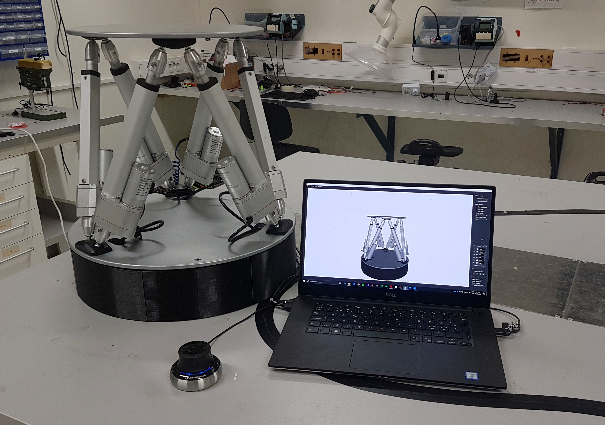

# StewartPlatform - Linux branch
Stewart Platform designed and implemented as part of my master thesis during the first half of 2020.

Here's an image of the Stewart Platform and this control GUI running on a laptop.

# Prerequisites 
* Qt and QtCreator.
* Eigen (`sudo apt install libeigen3-dev`)

# Compiling and running
Simply open the project in QtCreator, run "Configure" and then press compile/run.

